<div align="center">

<picture>
  <source media="(prefers-color-scheme: dark)"  srcset="./assets/ascii-dark.svg">
  <source media="(prefers-color-scheme: light)" srcset="./assets/ascii-light.svg">
  
</picture>

<br>

**문제를 정의하고, 빠르게 검증하고, 직접 만듭니다.**

<sub>I define the problem, validate it fast, and ship it myself.</sub>

</div>

---

### 🚀 Now building

**`groom·pick`** — 남성 그루밍 플랫폼. 문제 정의부터 MVP, 그로스까지 직접 굴리는 중입니다.

이전에는 SNUSV 33기 최연소 멤버로 메뉴 추천 서비스 **`뭐 먹을래`** 를 만들었고,
마감 시간 베이커리 할인 플랫폼 **`Fluffy`** 를 4인 팀으로 리드했습니다.

### 🛠 Stack


### 📬 Connect

- 🌐 Portfolio — <https://portfolio-self-rho-27.vercel.app>
- ✉️ powerla.personal@gmail.com

---

<details>
<summary>🎨 위 카드는 어떻게 만들어지나요?</summary>

<br>

`assets/avatar.png` 한 장을 **neofetch 스타일 ASCII 카드 SVG**로 변환해서 커밋합니다.
매일 06:17 (KST) 자동 실행되므로 repos · stars · commits 같은 숫자가 알아서 최신으로 유지됩니다.

카드가 하는 일 세 가지:

- **배경 매팅** — 테두리에서 안쪽으로 region-growing 해서 스튜디오 배경만 도려냅니다.
  덕분에 인물이 빈 공간 위에 떠 있는 실루엣으로 읽힙니다.
- **자기 타이핑 리빌** — SMIL `clipPath` 애니메이션으로 한 줄씩 그려지고,
  커서 블록이 줄을 따라 움직입니다. 약 4.2초 후 완성된 상태로 고정됩니다.
- **폰트 독립 정렬** — 모든 행에 `textLength` + `lengthAdjust`를 걸어서
  보는 사람의 기본 monospace 폰트가 무엇이든 격자가 어긋나지 않습니다.

| | |
|---|---|
| **워크플로우** | [`.github/workflows/ascii-card.yml`](.github/workflows/ascii-card.yml) |
| **렌더러** | [`tools/render_ascii_card.py`](tools/render_ascii_card.py) — Pillow만 사용 |
| **패널 문구** | [`card.json`](card.json) — 비워두면 GitHub API 값으로 대체됩니다 |
| **원본 도구** | [crafter-station/gh-ascii](https://github.com/crafter-station/gh-ascii) · <https://gh.crafter.run> |

**소스 두 가지**

- `photo` (기본) — 레포에 커밋된 `assets/avatar.png`를 직접 렌더링합니다.
  계정 아바타가 무엇이든 이 사진이 카드에 들어갑니다.
- `gh-ascii` — [gh.crafter.run](https://gh.crafter.run)에서 카드를 그대로 받아옵니다.
  이쪽은 **GitHub 계정 아바타**를 읽으므로, 프로필 사진을 이 사진으로 바꾼 뒤에 쓰면 됩니다.

전환은 Actions 탭 → *ASCII profile card* → **Run workflow** 에서 `source`를 고르면 됩니다.

**직접 돌려보기**

```bash
pip install pillow
python tools/render_ascii_card.py \
  --image assets/avatar.png --handle lafley-lucas \
  --profile-json card.json --theme dark --out assets/ascii-dark.svg
```

| 플래그 | 기본값 | 하는 일 |
|---|---|---|
| `--cols` | `120` | ASCII 가로 해상도 (40–200) |
| `--cutout` | `16` | 배경 매팅 허용치. `0` 이면 배경을 남깁니다 |
| `--animate` | `4.2` | 타이핑 리빌 길이(초). `0` 이면 정적 카드 |
| `--contrast` · `--unsharp` | `7.0` · `1.8` | 명암 S-커브 / 얼굴 디테일 강조 |

</details>
